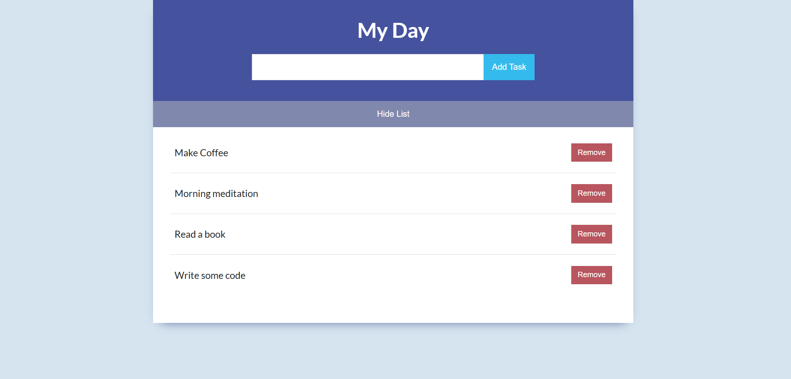
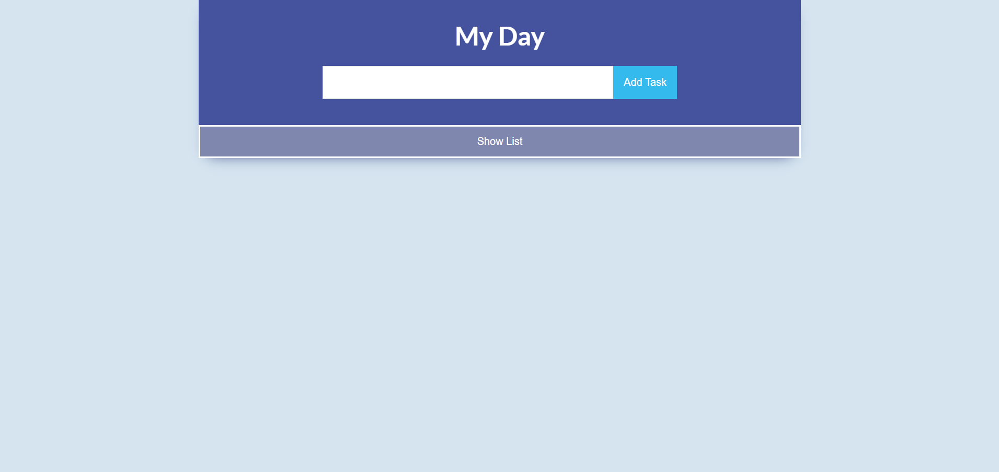
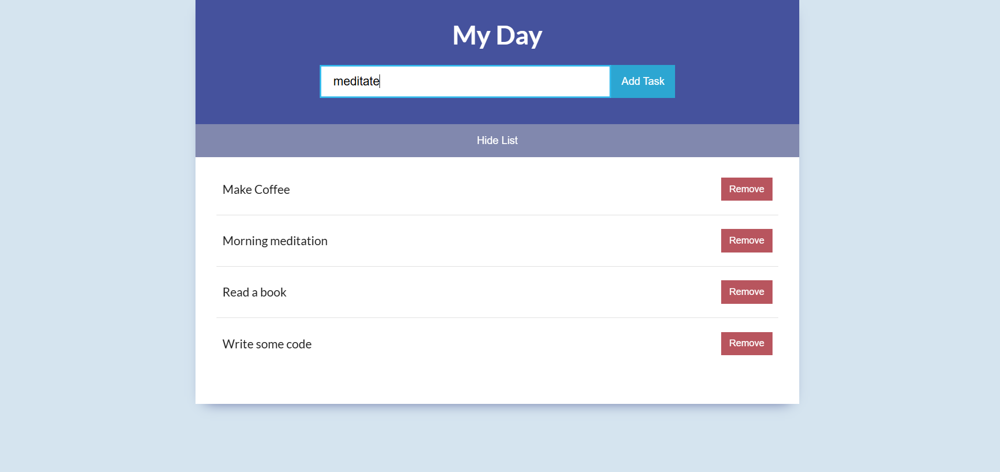
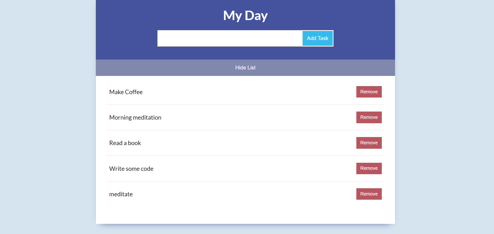
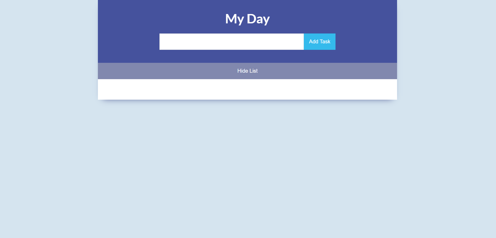

## Daily Task App ✅ https://velvetred2020.github.io/Daily_task_app/

**Daily Task App is a clean and simple to-do list manager built with HTML, CSS, and JavaScript. It helps you organize your daily tasks by allowing you to add, view, hide, and remove items from a dynamic list. Whether you're planning your day or decluttering your mind, this app keeps your tasks in check with minimal effort.**

## 📸 Screenshots
| **App View** |
|----------------|
|  |
| **Hide Task List** |
|  |
| **Add New Task** |
|  |
| **Task Added** |
|  |
| **All Tasks Removed** |
|  |

## ✨ Features

- **Task Management**:
  - Add new tasks using the input box.
  - View all tasks in a scrollable list.
  - Remove tasks individually with a delete button.

- **Visibility Toggle**:
  - Show or hide the entire task list with a single click.

- **Minimalist Design**:
  - Clean and responsive layout for distraction-free productivity.
  - No frameworks—just pure HTML, CSS, and JavaScript.

## 🛠️ Technologies Used

- **HTML**: Structure of the app.
- **CSS**: Styling and layout.
- **JavaScript**: Core logic for task handling and interactivity.

## 📋 Prerequisites

To run Daily Task App locally, you need:
- A modern web browser (e.g., Chrome, Firefox, Edge).
- Git (optional, for cloning the repository).

## 🚀 Getting Started

You can use the app by clicking the link at the top or here: https://velvetred2020.github.io/Daily_task_app/

To run it locally:

### 1. Clone the Repository
```bash
git clone https://github.com/velvetred2020/Daily_task_app.git
cd Daily_task_app
```

### 2. Open the App
Just open the `index.html` file in your browser.

### 🖼️ How It Works

**1. Add Tasks**
  - Type your task into the input box and click "Add".
  - The task appears instantly in the list.

**2. Hide/Show List**
  - Click the "Hide List" button to collapse the task view.
  - Click again to reveal your tasks.

**3. Remove Tasks**
  - Each task has a delete button to remove it from the list.

**4. Clean Interface**
  - Designed for simplicity and ease of use.

### 📂 Project Structure (simplified)
```
Daily_task_app/
|-- index.html               # Main HTML file
|-- style.css                # CSS styling
|-- script.js                # JavaScript logic
|-- media/                   # Folder for screenshots
|-- LICENSE                  # MIT License
|-- README.md                # This file
```

## 🔧 Usage Notes

- Works on all modern browsers.
- No installation required—just open the HTML file.
- Fully responsive for desktop and mobile.

## 🐞 Troubleshooting

- **Tasks Not Adding**: Make sure JavaScript is enabled.
- **List Not Hiding**: Refresh the page and try again.
- **App Not Loading**: Confirm all files are in the same directory.

## 🌟 Contributing

Contributions are welcome! 🤝

1. Fork the repository.  
2. Create a new branch (`git checkout -b feature/your-feature`).  
3. Commit your changes (`git commit -m "Add your feature"`).  
4. Push to the branch (`git push origin feature/your-feature`).  
5. Open a Pull Request.

### Ideas for contributions:
- Add task editing functionality.
- Implement task categories or priorities.
- Enhance the UI with animations or themes.

## 📜 License

This project is licensed under the MIT License. See the LICENSE file for details.


## 👐 Acknowledgments

- Inspired by the simplicity of classic to-do apps.
- Thanks to the open-source community for continuous inspiration.

Built with 💻 and ☕ by Elena. Star ⭐ this repo if you find it useful!
